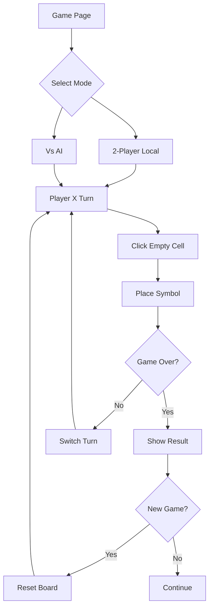

## 1. Product Overview

A classic Tic Tac Toe web game that allows users to play locally against another player or challenge an AI opponent. The game provides an intuitive interface for quick entertainment and strategic gameplay.

Players can enjoy traditional 3x3 grid gameplay with immediate feedback, score tracking, and the ability to restart games at any time. Perfect for casual gaming sessions and improving strategic thinking skills.

## 2. Core Features

### 2.1 User Roles

This application does not require user registration or authentication. All players are anonymous users who can immediately start playing without creating accounts.

### 2.2 Feature Module

Our Tic Tac Toe requirements consist of the following main pages:

1. **Game Board**: Interactive 3x3 grid, player turn indicator, score display, game mode selector.
2. **Game Controls**: New game button, reset score button, mode switcher (2-player vs AI).

### 2.3 Page Details

| Page Name     | Module Name        | Feature description                                                                           |
| ------------- | ------------------ | --------------------------------------------------------------------------------------------- |
| Game Board    | Interactive Grid   | Click cells to place X or O, prevent clicks on occupied cells, highlight winning combinations |
| Game Board    | Turn Indicator     | Display current player turn (X or O), show player symbols clearly                             |
| Game Board    | Score Display      | Track wins for both players, show draw count, persist scores during session                   |
| Game Board    | Game Mode Selector | Switch between 2-player local mode and AI opponent mode                                       |
| Game Controls | New Game Button    | Reset board state while keeping scores, clear current game progress                           |
| Game Controls | Reset Score Button | Clear all win/draw statistics, start fresh scoring                                            |
| Game Controls | AI Difficulty      | Simple AI using minimax algorithm or basic strategy for computer opponent                     |

## 3. Core Process

Players arrive at the game page and can immediately start playing. They select their preferred game mode (2-player local or vs AI), then take turns clicking on the 3x3 grid to place their symbols. The game automatically detects wins, draws, and switches turns appropriately. Players can start new games or reset scores at any time.

## 4. User Interface Design

### 4.1 Design Style

* **Primary Colors**: Deep blue (#1a365d) for X symbols, warm red (#e53e3e) for O symbols

* **Background**: Clean white background with subtle gray grid lines (#f7fafc)

* **Button Style**: Rounded corners (8px radius), subtle shadows, hover effects

* **Typography**: Sans-serif font (Inter or system fonts), 16px base size

* **Layout**: Centered card-based design with maximum width of 600px

* **Icons**: Simple geometric shapes, no emoji - clean SVG symbols

### 4.2 Page Design Overview

| Page Name     | Module Name    | UI Elements                                                                         |
| ------------- | -------------- | ----------------------------------------------------------------------------------- |
| Game Board    | 3x3 Grid       | 90px x 90px cells, 2px gray borders, hover highlight effect, winning line animation |
| Game Board    | Turn Display   | Bold text showing "Player X's Turn" or "Computer's Turn", symbol icon next to text  |
| Game Board    | Score Panel    | Horizontal layout with player names, win counts, draw count, clear typography       |
| Game Controls | Mode Buttons   | Toggle switch or button group, active state highlighting, smooth transitions        |
| Game Controls | Action Buttons | Primary blue buttons with white text, consistent sizing (120px width)               |

### 4.3 Responsiveness

Desktop-first design approach with mobile adaptation. The game board scales appropriately for smaller screens while maintaining playability. Touch interactions are optimized for mobile devices with larger touch targets (minimum 44px).
