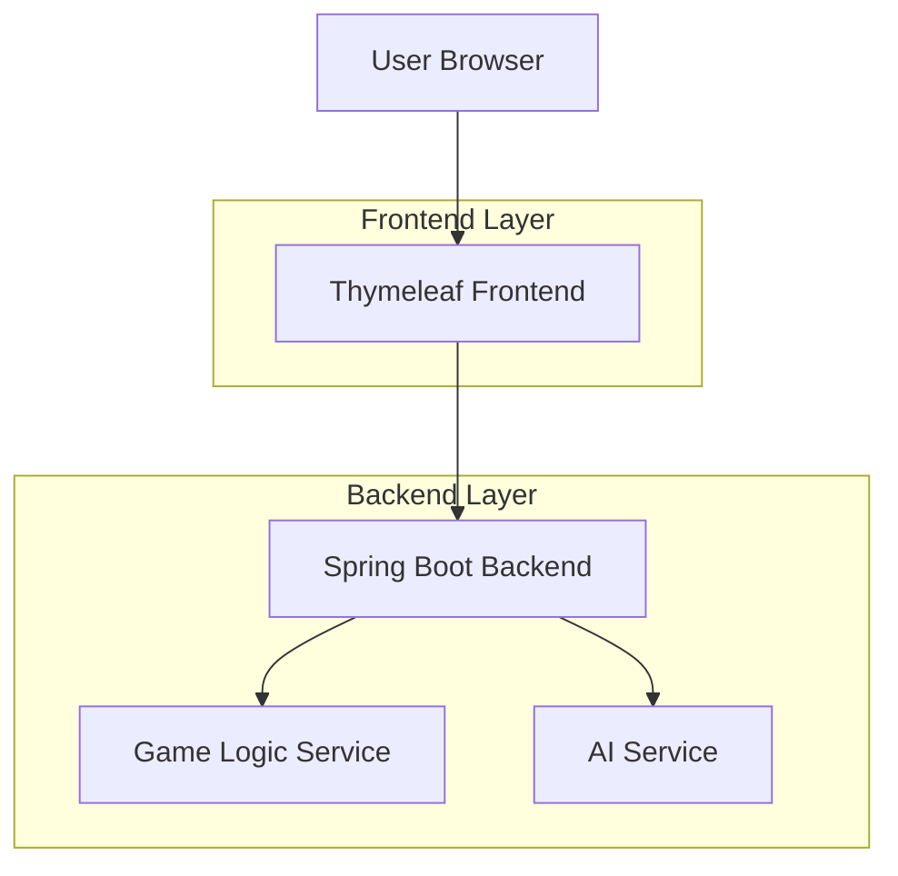
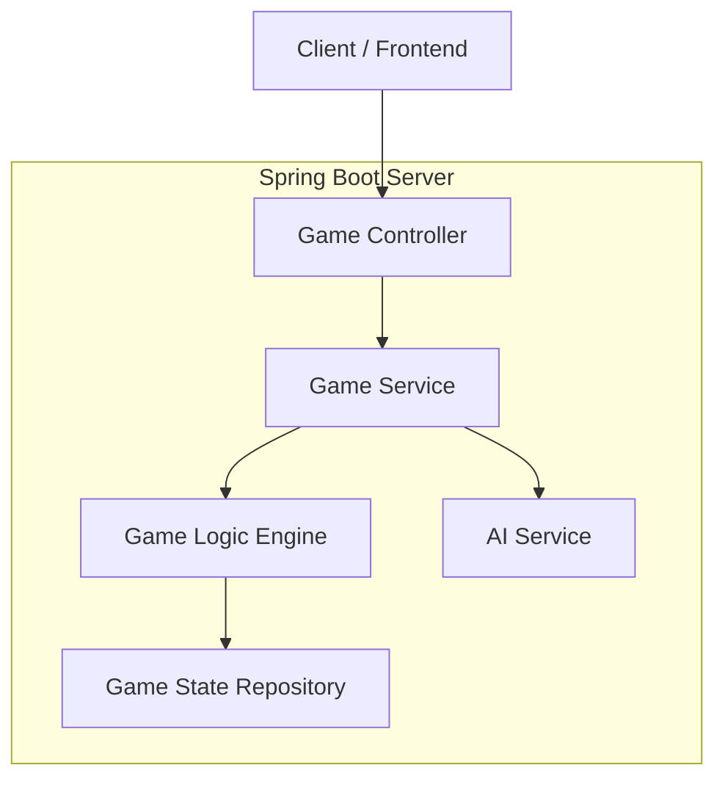
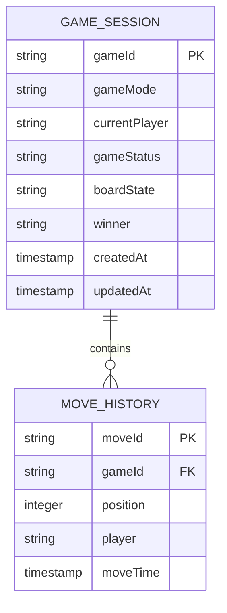

## 1. Architecture design



## 2. Technology Description

* **Frontend**: HTML5 + CSS3 + JavaScript + Thymeleaf templating

* **Backend**: Java 17 + Spring Boot 3.x

* **Build Tool**: Maven

* **Template Engine**: Thymeleaf

* **AI Algorithm**: Minimax algorithm with alpha-beta pruning

## 3. Route definitions

| Route             | Purpose                                            |
| ----------------- | -------------------------------------------------- |
| /                 | Main game page, displays the Tic Tac Toe board     |
| /api/game/new     | Initialize a new game session                      |
| /api/game/move    | Process player moves and return updated game state |
| /api/game/reset   | Reset current game while preserving scores         |
| /api/scores/reset | Reset all win/draw statistics                      |

## 4. API definitions

### 4.1 Game Management API

Initialize new game

```
POST /api/game/new
```

Request:

| Param Name  | Param Type | isRequired | Description                                |
| ----------- | ---------- | ---------- | ------------------------------------------ |
| gameMode    | string     | true       | Game mode: "TWO\_PLAYER" or "AI"           |
| firstPlayer | string     | false      | Starting player: "X" or "O" (default: "X") |

Response:

| Param Name    | Param Type | Description                                |
| ------------- | ---------- | ------------------------------------------ |
| gameId        | string     | Unique game session identifier             |
| board         | array      | Current board state (9 elements, 0-8)      |
| currentPlayer | string     | Current player turn ("X" or "O")           |
| gameStatus    | string     | Game status: "IN\_PROGRESS", "WIN", "DRAW" |

Example:

```json
{
  "gameId": "game-123-abc",
  "board": ["", "", "", "", "", "", "", "", ""],
  "currentPlayer": "X",
  "gameStatus": "IN_PROGRESS"
}
```

### 4.2 Move Processing API

Process player move

```
POST /api/game/move
```

Request:

| Param Name | Param Type | isRequired | Description                     |
| ---------- | ---------- | ---------- | ------------------------------- |
| gameId     | string     | true       | Game session identifier         |
| position   | integer    | true       | Board position (0-8)            |
| player     | string     | true       | Player making move ("X" or "O") |

Response:

| Param Name    | Param Type | Description                                       |
| ------------- | ---------- | ------------------------------------------------- |
| board         | array      | Updated board state                               |
| currentPlayer | string     | Next player turn                                  |
| gameStatus    | string     | Updated game status                               |
| winner        | string     | Winner player if game ended ("X", "O", or "DRAW") |
| winningLine   | array      | Winning combination positions if applicable       |

## 5. Server architecture diagram



## 6. Data model

### 6.1 Data model definition



### 6.2 Data Definition Language

Game Sessions Table

```sql
-- Create game_sessions table
CREATE TABLE game_sessions (
    game_id VARCHAR(36) PRIMARY KEY,
    game_mode VARCHAR(20) NOT NULL CHECK (game_mode IN ('TWO_PLAYER', 'AI')),
    current_player CHAR(1) DEFAULT 'X' CHECK (current_player IN ('X', 'O')),
    game_status VARCHAR(20) DEFAULT 'IN_PROGRESS' CHECK (game_status IN ('IN_PROGRESS', 'WIN', 'DRAW')),
    board_state VARCHAR(100) DEFAULT '_________',
    winner CHAR(1) CHECK (winner IN ('X', 'O', 'DRAW')),
    created_at TIMESTAMP DEFAULT CURRENT_TIMESTAMP,
    updated_at TIMESTAMP DEFAULT CURRENT_TIMESTAMP
);

-- Create move_history table
CREATE TABLE move_history (
    move_id BIGINT AUTO_INCREMENT PRIMARY KEY,
    game_id VARCHAR(36) NOT NULL,
    position INTEGER NOT NULL CHECK (position BETWEEN 0 AND 8),
    player CHAR(1) NOT NULL CHECK (player IN ('X', 'O')),
    move_time TIMESTAMP DEFAULT CURRENT_TIMESTAMP,
    FOREIGN KEY (game_id) REFERENCES game_sessions(game_id)
);

-- Create indexes
CREATE INDEX idx_game_sessions_status ON game_sessions(game_status);
CREATE INDEX idx_move_history_game_id ON move_history(game_id);
CREATE INDEX idx_move_history_move_time ON move_history(move_time);
```

