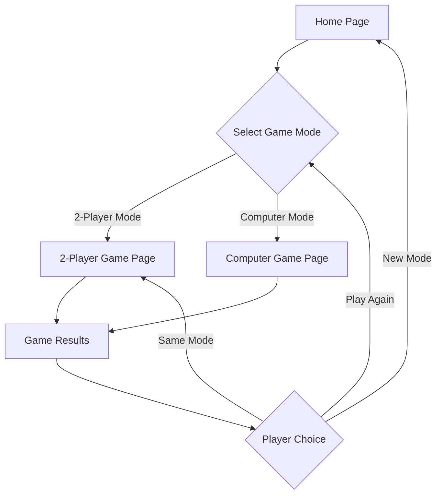

## 1. Product Overview
A modern web-based Tic-Tac-Toe game that allows players to enjoy classic gameplay with both human and AI opponents. Players can compete locally with friends or challenge an intelligent computer opponent.

The game provides an engaging digital experience for casual gaming, skill development, and entertainment across all age groups.

## 2. Core Features

### 2.1 User Roles
No user registration required - instant play for all users with full access to all game modes.

### 2.2 Feature Module
Our Tic-Tac-Toe requirements consist of the following main pages:
1. **Home page**: game mode selection, game statistics, quick start options.
2. **Game page**: interactive game board, player controls, game status display.
3. **Results page**: game outcome summary, play again options, statistics update.

### 2.3 Page Details
| Page Name | Module Name | Feature description |
|-----------|-------------|---------------------|
| Home page | Mode Selection | Choose between 2-player local mode or player vs computer mode with clear visual buttons. |
| Home page | Game Statistics | Display win/loss/draw statistics for both game modes with simple counters. |
| Home page | Quick Start | Start new game with selected mode using prominent start button. |
| Game page | Game Board | Interactive 3x3 grid where players click to place X or O symbols with smooth animations. |
| Game page | Player Controls | Clear indication of current player turn, reset game button, and return to home option. |
| Game page | Game Status | Real-time display of game progress, winner announcement, and draw detection. |
| Results page | Outcome Summary | Show winner or draw result with celebratory or neutral visual feedback. |
| Results page | Play Again Options | Quick restart with same settings or return to mode selection. |
| Results page | Statistics Update | Automatically update and display current game statistics. |

## 3. Core Process
Players begin at the home page where they select their preferred game mode. In 2-player mode, two humans take turns on the same device. In computer mode, the player competes against an AI opponent with strategic gameplay. The game automatically detects wins, losses, or draws and provides immediate feedback. Players can quickly restart or return to the main menu.

## 4. User Interface Design

### 4.1 Design Style
- **Primary Colors**: Deep blue (#1E3A8A) for player X, vibrant red (#DC2626) for player O
- **Secondary Colors**: Clean white (#FFFFFF) background, light gray (#F3F4F6) for UI elements
- **Button Style**: Rounded corners with subtle shadows, hover effects for interactivity
- **Font**: Modern sans-serif (Inter or similar), 16px base size with clear hierarchy
- **Layout Style**: Centered card-based design with generous spacing
- **Icons**: Simple line icons for navigation, game pieces as bold X and O symbols

### 4.2 Page Design Overview
| Page Name | Module Name | UI Elements |
|-----------|-------------|-------------|
| Home page | Mode Selection | Two large, colorful cards with icons and brief descriptions, prominent start buttons. |
| Home page | Statistics | Clean counter displays with progress bars and percentage indicators. |
| Game page | Game Board | Centered 3x3 grid with smooth hover states, clear turn indicator banner. |
| Game page | Player Controls | Floating action buttons for reset and home, status bar at top. |
| Results page | Outcome Summary | Large celebration icon, winner text with animation, confetti effect for wins. |

### 4.3 Responsiveness
Desktop-first design with mobile adaptation. Touch-optimized for tablets and smartphones with larger tap targets and simplified layouts for smaller screens.