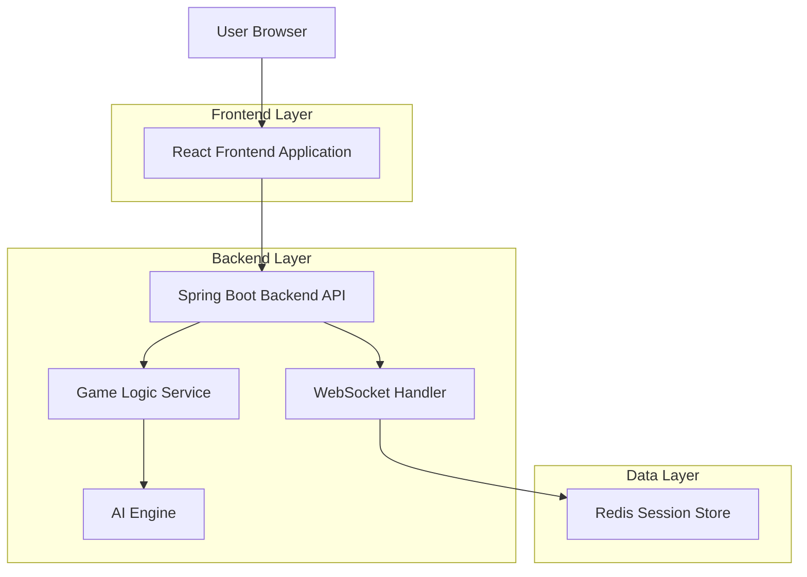

## 1. Architecture design

## 2. Technology Description
- Frontend: React@18 + tailwindcss@3 + vite
- Initialization Tool: vite-init
- Backend: Spring Boot@3 + Java 21
- Database: Redis (for session management and game state)
- Build Tool: Maven
- Container: Docker

## 3. Route definitions
| Route | Purpose |
|-------|---------|
| / | Home page, displays game mode selection and statistics |
| /game/local | Local 2-player game interface |
| /game/ai | Player vs